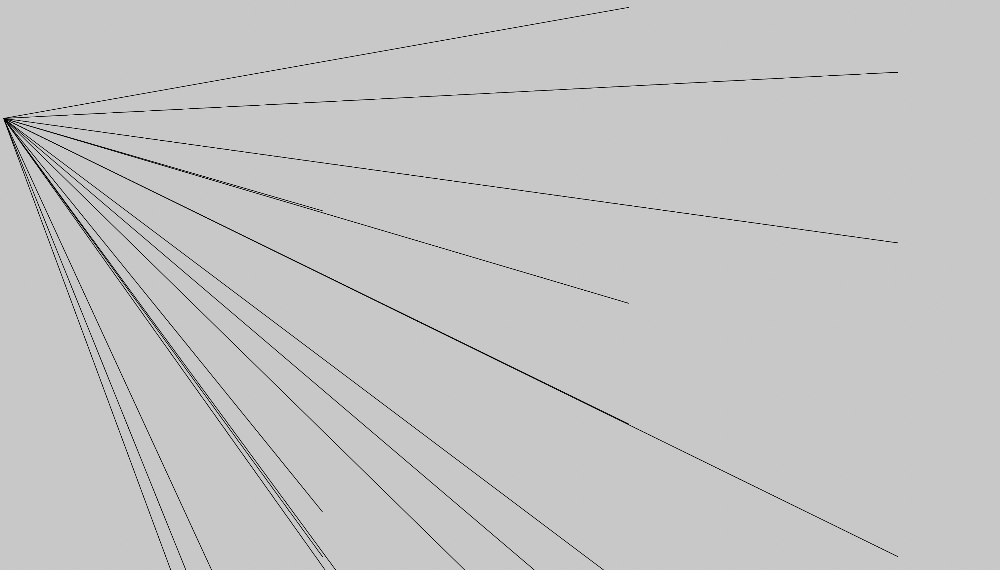
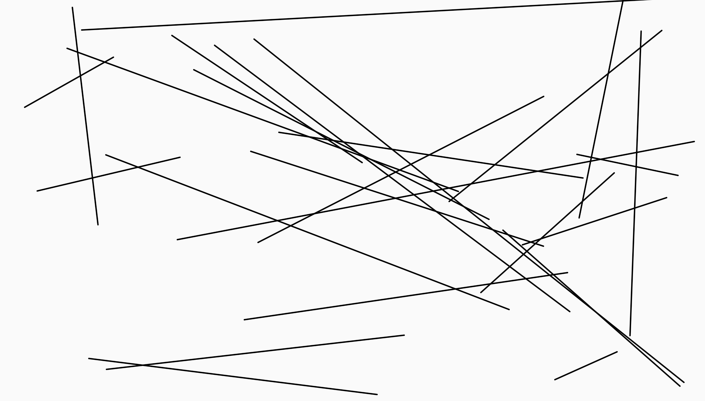

# Thinking
First, I want to explore how to make lines using for loop. 

1. two sets of x and y: x1 y1 x2 y2
2. use for loop to connect each pair

# 1st try
Okay, I overthought in my first attempt. I thought of a for loop this complicated:
  // for (let number = 0; number <= 25; number += 1){
  //   for (let x1pos = random(5,500); x1pos <= width; xpos += random(5,500)){
  //     for (let y1pos = random(5,500); y1pos <= height; ypos += random(5,500)){
  //       for (let x2pos = random(5,500); x2pos <= width; x2pos += random(5,500)){
  //         for (let y2pos = random(5,500); y2pos <= width; y2pos += random(5,500)){
  //           line(x1pos, y1pos, x2pos, y2pos)
  //         }
  //       }
  //     }
      
  // } //each set of points for 25 times
  // }

  Here was what I got:
  Image on repo:  

# 2nd try
  Then I realized if I'm using line() it would be just fine to use random() on the four points.
  I put a randomseed() on the drawing. 
  Here's the final drawing.

  Image on repo:  

# Question I encountered
I discovered that I can only use random() inside the for loop. If I have a parameter named in the first line of code using random(), it would not work if I just put the parameter inside the loop. Like:

let diam = 1
let diamRandom = random(5, 500)